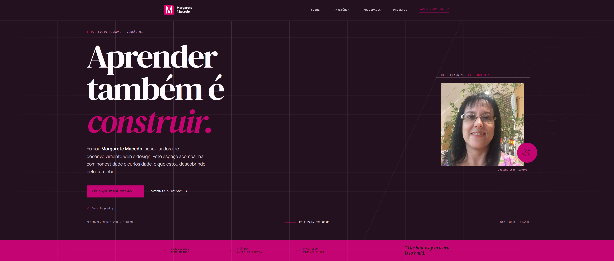
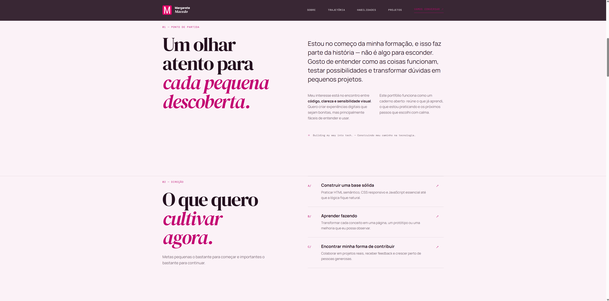
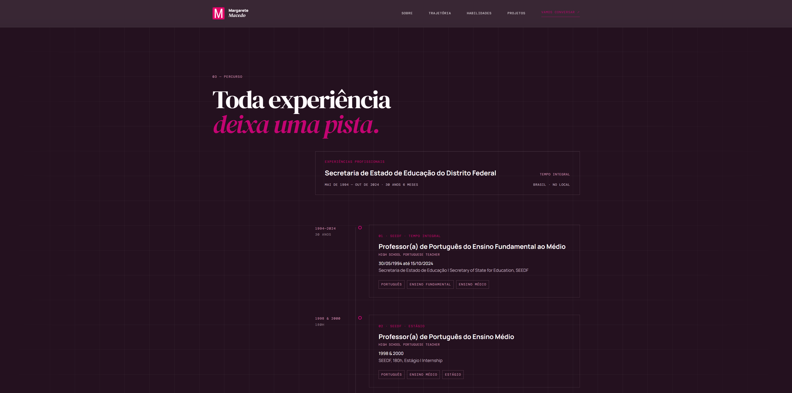
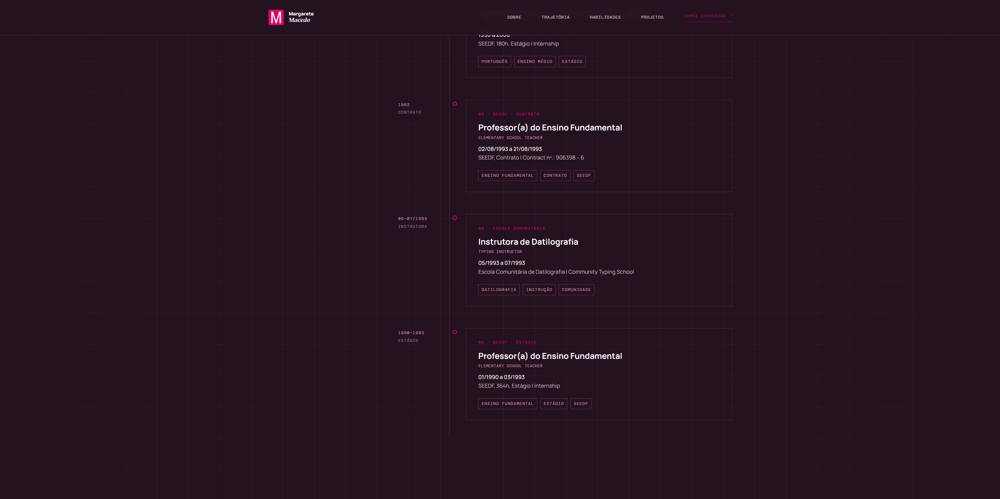
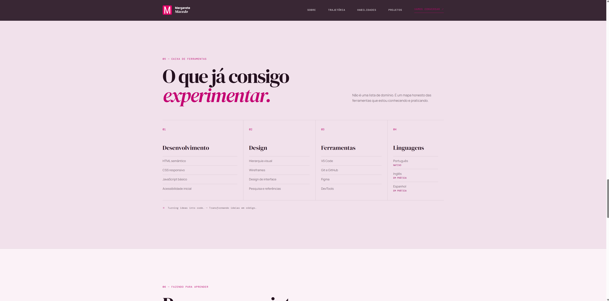
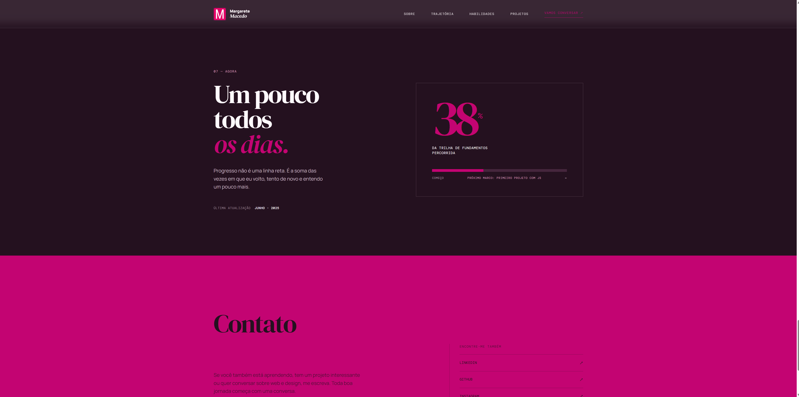
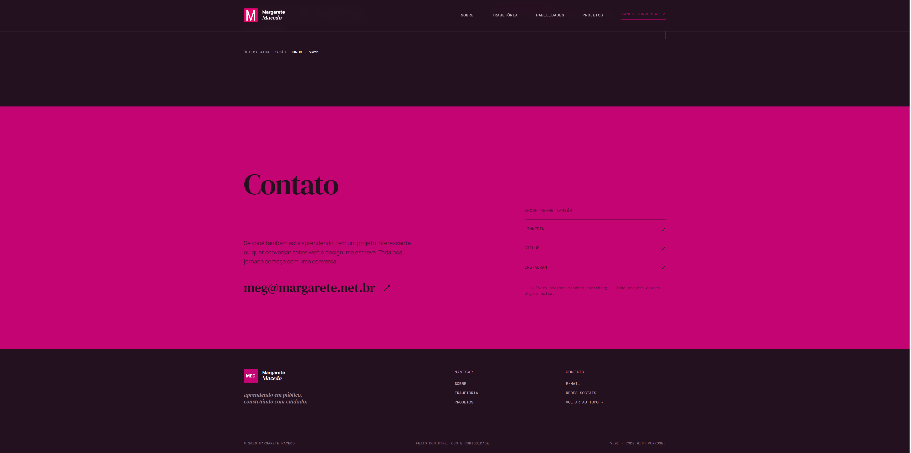

<div align="center">

# Portfolio Pessoal — Replit

### **Aprender também é construir.**

Um portfólio pessoal em evolução, criado para acompanhar a jornada de Margarete Macedo entre desenvolvimento web, tecnologia e design.

[⚠️ **Status do site**](https://github.com/MargareteSM/Portfolio-Pessoal-2) · [💻 **Abrir repositório**](https://github.com/MargareteSM/Portfolio-Pessoal-2)

> O site atingiu o limite do plano Start do Replit e, por essa razão, não será possível continuar a atualizar este projeto nesta hospedagem.

</div>

---

## ✦ Sobre o projeto

O **Portfolio-Pessoal-2** é um espaço de apresentação, prática e experimentação. A proposta é reunir trajetória profissional, formação, habilidades, projetos em construção e próximos passos em desenvolvimento.

Mais do que uma página finalizada, este repositório registra um caminho em movimento: cada seção representa uma descoberta, uma tentativa ou uma nova camada de aprendizado em desenvolvimento web e design.

> **Ideias em código. Aprendizado em movimento.**

## ✦ Preview

A identidade visual do projeto combina composição editorial, contraste entre superfícies claras e escuras, tipografia expressiva, detalhes em coral e elementos gráficos inspirados em blueprint.










## ✦ Tecnologias

<p>
  
  
  
  
  
  
  
</p>

- **HTML5 e CSS3** — estrutura semântica, composição visual, responsividade, tipografia e acessibilidade.
- **JavaScript** — interações e comportamentos da experiência visual existente.
- **TypeScript e React** — estrutura de workspace e artefato de aplicação em desenvolvimento.
- **Vite** — desenvolvimento e build do artefato `portfolio-pessoal`.
- **Tailwind CSS** — utilitários e configuração de estilos presentes no artefato React.
- **pnpm** — gerenciamento de dependências e organização do workspace.

## ✦ Características

- Página de portfólio com navegação por seções e apresentação pessoal.
- Conteúdos sobre trajetória profissional, formação acadêmica e cursos de extensão.
- Áreas dedicadas a habilidades, ferramentas, projetos e objetivos de aprendizado.
- Layout responsivo e composição visual com linguagem editorial.
- Microinterações, revelação de conteúdo e acompanhamento visual de progresso na experiência HTML/CSS/JavaScript.
- Recursos de acessibilidade, como link para pular ao conteúdo, foco visível e respeito à preferência por redução de movimento.
- Canais de contato por e-mail, GitHub, LinkedIn e Instagram presentes na aplicação.
- Workspace preparado para evolução com TypeScript, React, Vite e pacotes do ecossistema Replit.

## ✦ Estrutura do projeto

```text
.
├── artifacts/
│   ├── api-server/
│   ├── mockup-sandbox/
│   └── portfolio-pessoal/
│       ├── index.html
│       ├── package.json
│       ├── src/
│       ├── style.css
│       ├── script.js
│       └── vite.config.ts
├── lib/
├── screenshots/
│   └── portfolio-desktop.jpg
├── scripts/
├── package.json
├── pnpm-workspace.yaml
├── pnpm-lock.yaml
├── tsconfig.json
└── .replit
```

O principal artefato visual está em `artifacts/portfolio-pessoal/`. A raiz organiza o workspace, as configurações compartilhadas e os demais pacotes do projeto.

## ✦ Aprendizado

**Aprender também é construir.**

Este projeto funciona como um ambiente de estudo e experimentação: testar uma ideia, observar o resultado, ajustar a estrutura e transformar conceitos em algo visível. O portfólio continuará em evolução como uma documentação de processo, buscando cada vez mais clareza, eficiência e criatividade.

O objetivo não é apresentar uma trajetória pronta, mas documentar um processo real — com curiosidade, prática e espaço para os próximos capítulos.

## ✦ Executando o projeto

### Pré-requisitos

- Node.js, conforme o ambiente definido em `.replit`.
- [pnpm](https://pnpm.io/), utilizado pelos scripts e pelo lockfile do workspace.

### Instalar dependências

Na raiz do repositório:

```bash
pnpm install
```

### Executar o artefato de portfólio em desenvolvimento

```bash
pnpm --filter @workspace/portfolio-pessoal run dev
```

> O servidor Vite utiliza as variáveis de ambiente `PORT` e `BASE_PATH`, exigidas pela configuração do artefato.

### Gerar o build

```bash
pnpm --filter @workspace/portfolio-pessoal run build
```

### Verificar tipos

```bash
pnpm run typecheck
```

## ✦ Links

- **Status do site:** o projeto atingiu o limite do plano Start do Replit. Por isso, o site não está mais disponível online e não será possível continuar a atualização deste projeto nessa hospedagem.
- **Repositório GitHub:** [MargareteSM/Portfolio-Pessoal-2](https://github.com/MargareteSM/Portfolio-Pessoal-2)

## ✦ Autora

**Margarete Macedo**  
Pesquisadora de Tecnologia, Desenvolvimento Web e Design.

- [GitHub](https://github.com/MargareteSM)
- [LinkedIn](https://www.linkedin.com/in/margaretesm)
- [Instagram](https://instagram.com/margaretesmm)
- [E-mail](mailto:meg@margarete.net.br)

---

<div align="center">

**Aprender. Criar. Experimentar. Evoluir.**

</div>
