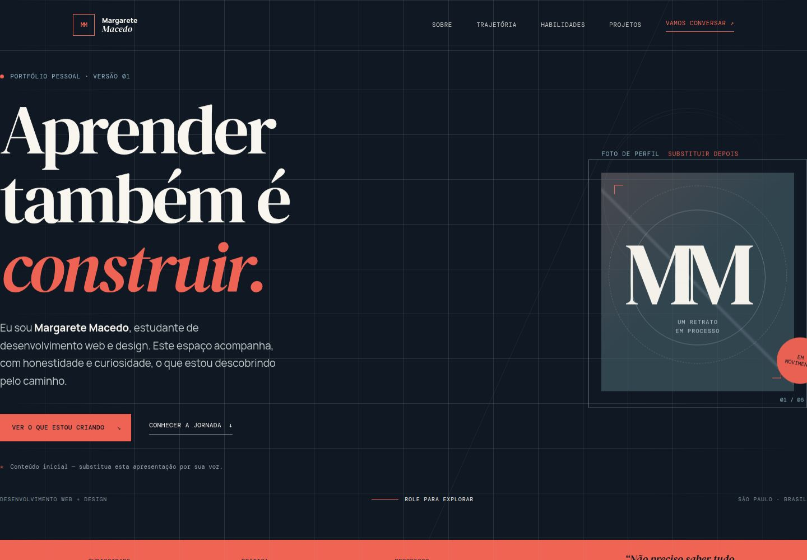

1| <div align="center">
2| 
3| # Portfolio Pessoal V0.1 — Margarete Macedo
4| 
5| ### Aprender também é construir.
6| 
7| Um portfólio pessoal em evolução, criado como parte da jornada de aprendizado em desenvolvimento web e design.
8| 
9| [Visualizar aplicação](https://77c5be57-fdf1-4a78-9915-821222f0fa84-00-3byfcfu1p23jx.reed.replit.dev/) · [Abrir no Replit](https://replit.com/@margaretesm/Portfolio-Pessoal-Replit) · [Ver no GitHub](https://github.com/MargareteSM/Portfolio-Pessoal-Replit)
10| 
11| </div>
12| 
13| ---
14| 
15| ## Sobre o projeto
16| 
17| O **Portfolio Pessoal V0.1** é uma página única que apresenta a trajetória, os estudos, as habilidades em desenvolvimento, os projetos em construção e os canais de contato de Margarete Macedo.
18| 
19| Mais do que uma página finalizada, este repositório funciona como um registro de prática e experimentação. Cada versão acompanha novos aprendizados e pode receber melhorias conforme novos conhecimentos forem adquiridos.
20| 
21| > **Ideias em código. Aprendizado em movimento.**
22| 
23| ## Preview
24| 
25| 
26| 
27| ## Demonstração
28| 
29| - **Aplicação/preview:** [acessar o portfólio](https://77c5be57-fdf1-4a78-9915-821222f0fa84-00-3byfcfu1p23jx.reed.replit.dev/)
30| - **Projeto no Replit:** [Portfolio-Pessoal-Replit](https://replit.com/@margaretesm/Portfolio-Pessoal-Replit)
31| - **Repositório no GitHub:** [MargareteSM/Portfolio-Pessoal-Replit](https://github.com/MargareteSM/Portfolio-Pessoal-Replit)
32| 
33| ## Tecnologias
34| 
35| <p>
36|   
37|   
38|   
39|   
40|   
41|   
42| </p>
43| 
44| - **HTML5:** estrutura semântica da página e metadados para compartilhamento.
45| - **CSS3:** direção visual, layout responsivo, animações, tipografia e suporte a preferência por redução de movimento.
46| - **JavaScript:** interações da navegação, revelação de conteúdo, contador de progresso e atualização automática do ano.
47| - **TypeScript:** utilizado na configuração e na estrutura de workspace, incluindo o artefato React existente no repositório.
48| - **Vite:** ferramenta de desenvolvimento e build configurada para o artefato do portfólio.
49| - **pnpm:** gerenciamento de dependências e organização do monorepo/workspace.
50| 
51| ## Funcionalidades
52| 
53| - Página única com navegação por seções: sobre, trajetória, aprendizado, habilidades, projetos, progresso e contato.
54| - Menu de navegação adaptado para telas menores, com botão de abertura e fechamento.
55| - Layout responsivo para diferentes tamanhos de tela.
56| - Seções de apresentação da trajetória profissional e formação acadêmica.
57| - Listas de habilidades, cursos, projetos em construção e objetivos de aprendizado.
58| - Animação de revelação dos blocos quando entram na área visível da página.
59| - Contador e barra de progresso animados na seção de acompanhamento da jornada.
60| - Atualização automática do ano exibido no rodapé.
61| - Link de acesso ao conteúdo para navegação por teclado e estilos de foco visível.
62| - Tratamento da preferência do sistema por redução de movimento.
63| - Links de contato por e-mail e para GitHub, LinkedIn e Instagram.
64| 
65| ## Estrutura do projeto
66| 
67| ```text
68| .
69| ├── artifacts/
70| │   ├── api-server/
71| │   ├── mockup-sandbox/
72| │   └── portfolio-pessoal/
73| ├── lib/
74| ├── screenshots/
75| ├── scripts/
76| ├── package.json
77| ├── pnpm-workspace.yaml
78| ├── pnpm-lock.yaml
79| ├── tsconfig.json
80| └── .replit
81| ```
82| 
83| O artefato visual principal do portfólio está em `artifacts/portfolio-pessoal/`.
84| 
85| ## Como executar
86| 
87| ### Pré-requisitos
88| 
89| - Node.js, conforme o ambiente configurado no `.replit`.
90| - pnpm, utilizado pelos scripts e pelo lockfile do projeto.
91| 
92| ### Instalar dependências
93| 
94| Na raiz do repositório:
95| 
96| ```bash
97| pnpm install
98| ```
99| 
100| ### Executar o portfólio em desenvolvimento
101| 
102| ```bash
103| pnpm --filter @workspace/portfolio-pessoal run dev
104| ```
105| 
106| ### Gerar o build do portfólio
107| 
108| ```bash
109| pnpm --filter @workspace/portfolio-pessoal run build
110| ```
111| 
112| ### Verificar tipos
113| 
114| ```bash
115| pnpm run typecheck
116| ```
117| 
118| ## Desenvolvimento e aprendizado
119| 
120| Este projeto representa uma etapa inicial e real de aprendizado. A proposta é construir enquanto se aprende: testar ideias, observar resultados, organizar descobertas e evoluir gradualmente.
121| 
122| O portfólio não pretende apresentar uma trajetória pronta. Ele documenta um caminho em movimento — com espaço para experimentação, ajustes e novos projetos.
123| 
124| ## Roadmap
125| 
126| - aprimoramentos visuais e de composição;
127| - melhorias de responsividade em diferentes dispositivos;
128| - evolução contínua de acessibilidade;
129| - otimizações de estrutura e carregamento;
130| - inclusão de novos projetos e experimentos;
131| - refinamento conforme novos conhecimentos forem adquiridos.
132| 
133| ## Autora
134| 
135| **Margarete Macedo**
136| 
137| - GitHub: [@MargareteSM](https://github.com/MargareteSM)
138| 
139| ## Licença
140| 
141| Não foi encontrado um arquivo `LICENSE` neste repositório. Portanto, nenhuma licença é declarada nesta documentação.
142| 
143| ---
144| 
145| <div align="center">
146| 
147| **Aprender também é construir.**
148| 
149| </div>
150| 